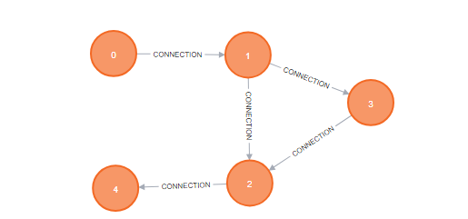
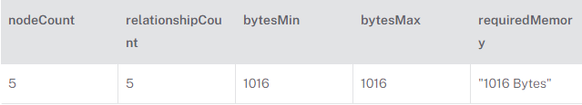
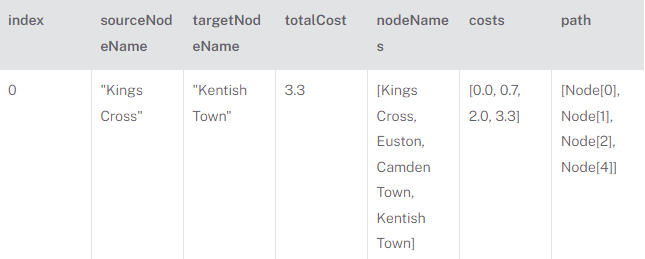
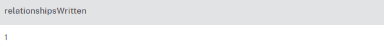
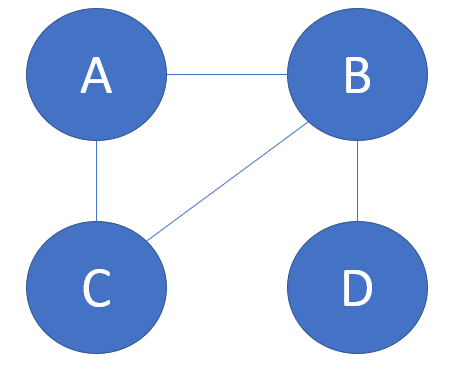

# Neo4j : Opérateurs avancés

## A\* plus court chemin, PageRank

### Contributeurs

- [Hamon Guillaume](https://github.com/Gham0n/tpjpa2023)
- [Léo Nolière](https://github.com/LeoNoliere)
- [François Autin](https://github.com/francoiautin)
- [Remi Rativel]()

### Intro

Neo4j est une technologie de gestion de base de données parue en Février 2010. La représentation de ces bases est faite sous formes de nœuds reliés par des arcs décrivants des relations, et possédant eux mêmes différentes propriétés. C’est un outil puissant, utilisant le langage Cypher, capable de répondre à des requêtes faisant intervenir des relations entre objets. Il peut notamment être utilisé dans la recherche de plus court chemin, ou pour l’algorithme PageRank utilisé par Google.

### Contexte

#### A*

L’algorithme A*( “A-étoile” ou “A-Star” en anglais) sert à calculer le plus court chemin entre deux nœuds d’un graphe, privilégiant la rapidité de calcul à l’exactitude du résultat. Il s’agit d’une extension de l’algorithme de Dijkstra proposée 9 ans après celui-ci, en 1968 par Peter Elliot Hart, Nils John Nilsson et Bertram Raphael. Elle a vu le jour lorsque Nilsson a voulu améliorer la planification d’un robot prototype qui se déplace dans une pièce avec des obstacles et a créé une version plus rapide de l’algorithme de Dijkstra. Ses deux collègues ont à leur tour apporté leurs modifications, afin d’aboutir à une version jugée optimale : A*.

#### Pagerank

PageRank est un algorithme utilisé au sein du système de classement de pages de Google. Inventé par Larry Page à Stanford en 1996, il est l’innovation principale ayant permis à Google de se différencier de la concurrence. Il permet de mesurer la popularité d’une page web en fonction du nombre de liens connus du système permettant de s’y rendre, ce qui a pour effet de pouvoir estimer la pertinence d’une page en fonction de sa popularité.

PageRank est aujourd’hui agrémenté d’autres algorithmes afin de raffiner la précision des résultats Google, notamment à cause de sa faiblesse face aux comportements malveillants d’utilisateurs du système. Seul, il reste néanmoins très utile afin de déterminer la popularité de nœuds dans un graphe dont les sources sont de confiance.

### Definition

#### A*

A* s’applique sur un graphe et commence à un nœud choisi auquel il applique un coût (0 pour le nœud initial). A* estime ensuite la distance qui sépare ce nœud du but à atteindre. Le coût heuristique assigné au chemin menant à ce noeud est la somme du coût et de l'évaluation d'une fonction heuristique déterminée à l'avance. Le nœud est alors ajouté à une file d'attente prioritaire, couramment appelée open list. Il va ensuite retirer le premier nœud de la file d’attente prioritaire, qui par définition possède l’heuristique la plus basse. Si la file se vide avant d’arriver au nœud final c’est qu’il n’existe aucun chemin entre le nœud initial et le nœud final.
Si le nœud n'est pas final, de nouveaux nœuds sont créés pour chaque nœud contigu admissible. Pour chaque nœud successif, A\* calcule son coût et le stocke avec le nœud. Ce coût est calculé à partir de la somme du coût de son ancêtre et du coût de l'opération pour atteindre ce nouveau nœud. L'algorithme maintient également la liste de nœuds qui ont été vérifiés, couramment appelée closed list. Si un nœud nouvellement produit est déjà dans cette liste avec un coût égal ou inférieur, aucune opération n'est faite.

#### PageRank

L'algorithme PageRank évalue l'importance relative des nœuds dans un graphe en attribuant des scores basés sur la structure du réseau. Le principe sous-jacent repose sur l'idée que les nœuds qui sont connectés à d'autres nœuds importants doivent également être considérés comme importants. Le calcul du PageRank s'effectue de manière itérative, chaque nœud recevant un score qui dépend de la somme des scores de ses voisins.

Mathématiquement, le score PageRank `PR(u)` d'un nœud `u` est déterminé par la formule :

```
PR(u) = (1 - d) + d * (PR(v)/L(v))
```

où :

- `d` représente le facteur d'amortissement (habituellement autour de 0,85),
- `v` parcourt tous les nœuds voisins de `u`,
- `L(v)` indique le nombre de liens sortants de `v`.

Ce processus est répété jusqu'à ce que les scores convergent vers une valeur stable.

### Exemple

#### A*



Prenons le graphe ci-dessus comme exemple. En Cypher celui-ci se code de la manière suivante :

```Cypher
CREATE  (a:Station { name: 'Kings Cross',         	latitude: 51.5308, longitude: -0.1238 }),
       	(b:Station { name: 'Euston',					latitude: 51.5282, longitude: -0.1337 }),
       	(c:Station { name: 'Camden Town',          	latitude: 51.5392, longitude: -0.1426 }),
       	(d:Station { name: 'Mornington Crescent',	latitude: 51.5342, longitude: -0.1387 }),
       	(e:Station { name: 'Kentish Town',       	latitude: 51.5507, longitude: -0.1402 }),
       	(a)-[:CONNECTION { distance: 0.7 }] -> (b),
       	(b)-[:CONNECTION { distance: 1.3 }] -> (c),
       	(b)-[:CONNECTION { distance: 0.7 }] -> (d),
       	(d)-[:CONNECTION { distance: 0.6 }] -> (c),
       	(c)-[:CONNECTION { distance: 1.3 }] -> (e)
```

Tout d’abord, on lance une estimation du coût en mémoire pour faire tourner l'algorithme sur ce graphe :

```cypher
MATCH   (source:Station { name: 'Kings Cross' }), ( target:Station { name: 'Kentish Town' })
CALL gds.shortestPath.astar.write.estimate('myGraph', {
    sourceNode: source,
    targetNode: target,
    latitudeProperty: 'latitude',
    longitudeProperty: 'longitude',
    writeRelationshipType: 'PATH'
})
YIELD nodeCount, relationshipCount, bytesMin, bytesMax, requiredMemory
RETURN nodeCount, relationshipCount, bytesMin, bytesMax, requiredMemory
```

L’analyse rend ensuite un résultat. Si l'estimation montre que l'exécution peut dépasser les limites de la mémoire, l'exécution est interdite.



Arrivé ici, Neo4j nous permet de choisir entre 2 modes d'exécutions.
Premièrement le mode Stream, qui peut se résumer à une exécution classique de A\*.

```
MATCH (source:Station { name: 'Kings Cross' }), (target:Station { name: 'Kentish Town' })
CALL gds.shortestPath.astar.stream('myGraph', {
    sourceNode: source,
    targetNode: target,
    latitudeProperty: 'latitude',
    longitudeProperty: 'longitude',
    relationshipWeightProperty: 'distance'
})
YIELD index, sourceNode, targetNode, totalCost, nodeIds, costs, path
RETURN
    index,
    gds.util.asNode(sourceNode).name AS sourceNodeName,
    gds.util.asNode(targetNode).name AS targetNodeName,
    totalCost,
    [nodeId IN nodeIds | gds.util.asNode(nodeId).name] AS nodeNames,
    costs,
    nodes(path) as path
    ORDER BY index
```



On distingue alors le résultat du plus court chemin, proposé par l’algorithme.

Le second mode est “Mutate”, qui va mettre à jour le graphe en créant de nouvelles relations représentant un chemin entre le nœud source et le nœud cible.

```cypher
MATCH (source:Station { name: 'Kings Cross' }), (target:Station { name: 'Kentish Town' })
CALL gds.shortestPath.astar.mutate('myGraph', {
    sourceNode: source,
    targetNode: target,
    latitudeProperty: 'latitude',
    longitudeProperty: 'longitude',
    relationshipWeightProperty: 'distance',
    mutateRelationshipType: 'PATH'
})
YIELD relationshipsWritten
RETURN relationshipsWritten
```

Une nouvelle relation produite est toujours dirigée, même si le graphe d'entrée est non dirigé.

Resultat:



#### PageRank

Bien sûr, considérons un exemple plus concret avec un schéma textuel. Imaginons un petit réseau de pages web interconnectées, où chaque page est représentée par un nœud et les liens entre les pages sont représentés par des arêtes. Dans ce cas, nous allons utiliser l'algorithme PageRank pour évaluer l'importance relative de chaque page dans ce réseau.

##### Schéma :



##### Itérations de l'Algorithme PageRank :

###### Initialisation

Chaque page démarre avec un score PageRank initial (par exemple, 1.0).

###### Itération 1

- Calcul des nouveaux scores en appliquant la formule PageRank pour chaque page.
- Utilisation d'un facteur d'amortissement \(d\) (par exemple, 0.85).

```Cypher
PR(A) = (1 - 0.85) + 0.85 * (PR(B)/2 + PR(C)/1) = 0.075 + 0.85 * (PR(B)/2 + PR(C))
PR(B) = (1 - 0.85) + 0.85 * (PR(A)/2 + PR(C)/2 + PR(D)/1) = 0.075 + 0.85 * (PR(A)/2 + PR(C)/2 + PR(D))
PR(C) = (1 - 0.85) + 0.85 * (PR(A)/1 + PR(B)/2) = 0.15 + 0.85 * (PR(A) + PR(B)/2)
PR(D) = (1 - 0.85) + 0.85 * (PR(B)/1) = 0.075 + 0.85 * PR(B)
```

###### Itération 2

Répétition du processus avec les nouveaux scores calculés.

```Cypher
PR(A) = (1 - 0.85) + 0.85 * (PR(B)/2 + PR(C)/1)
PR(B) = (1 - 0.85) + 0.85 * (PR(A)/2 + PR(C)/2 + PR(D)/1)
PR(C) = (1 - 0.85) + 0.85 * (PR(A)/1 + PR(B)/2)
PR(D) = (1 - 0.85) + 0.85 * (PR(B)/1)
```

Ces itérations se répéteraient jusqu'à ce que les scores convergent vers des valeurs stables. À la fin, les pages avec des scores PageRank plus élevés sont considérées comme plus importantes dans le réseau, indiquant leur relative influence dans la structure de liens interconnectés.